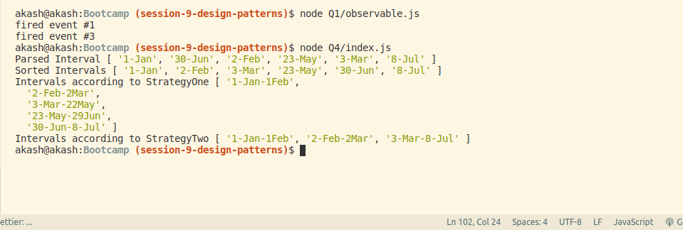

### Output  
  

### 3/7 Theory Questions  
#### Explain difference between Bind and Call (example).
The difference between call() and bind() is that the call() sets the this keyword and executes the function immediately and it does not create a new copy of the function, while the bind() creates a copy of that function and sets the this keyword.

Example:
function greeting() {
  console.log(`Hi, I am ${this.name} and I am ${this.age} years old`);
}
const john = {
  name: 'John',
  age: 24,
};

***A binded copy is not stored***
***Output: Hi, I am John and I am 24 years old***
greeting.call(john);

***A binded copy is stored***
greetingJohn = greeting.bind(john);
***Output: Hi, I am John and I am 24 years old***
greetingJohn();

#### Explain 3 properties of argument object.  
arguments is an Array-like object accessible inside functions that contains the values of the arguments passed to that function.  
3 properties:  
arguments.callee  
Reference to the currently executing function that the arguments belong to.  
arguments.length  
The number of arguments that were passed to the function.  
arguments[@@iterator]  
Returns a new Array iterator object that contains the values for each index in arguments.  

#### Explain 5 array methods with example.
#### concat
The method arr.concat creates a new array that includes values from other arrays and additional items.

The syntax is:

arr.concat(arg1, arg2...)
It accepts any number of arguments – either arrays or values.

The result is a new array containing items from arr, then arg1, arg2 etc.

If an argument argN is an array, then all its elements are copied. Otherwise, the argument itself is copied.

let arr = [1, 2];

// create an array from: arr and [3,4]
console.log( arr.concat([3, 4]) ); // 1,2,3,4

#### forEach
The arr.forEach method allows to run a function for every element of the array.

The syntax:

arr.forEach(function(item, index, array) {
  // ... do something with item
});
For instance, this shows each element of the array:

// for each element call alert
["Bilbo", "Gandalf", "Nazgul"].forEach(alert);

#### sort(fn)
The call to arr.sort() sorts the array in place, changing its element order.

It also returns the sorted array, but the returned value is usually ignored, as arr itself is modified.

For instance:
let arr = [ 1, 2, 15 ];

// the method reorders the content of arr
arr.sort();

alert( arr );  // 1, 15, 2

#### reverse
The method arr.reverse reverses the order of elements in arr.

For instance:

let arr = [1, 2, 3, 4, 5];
arr.reverse();

alert( arr ); // 5,4,3,2,1
It also returns the array arr after the reversal.

#### arr.pop() 
– extracts an item from the end,