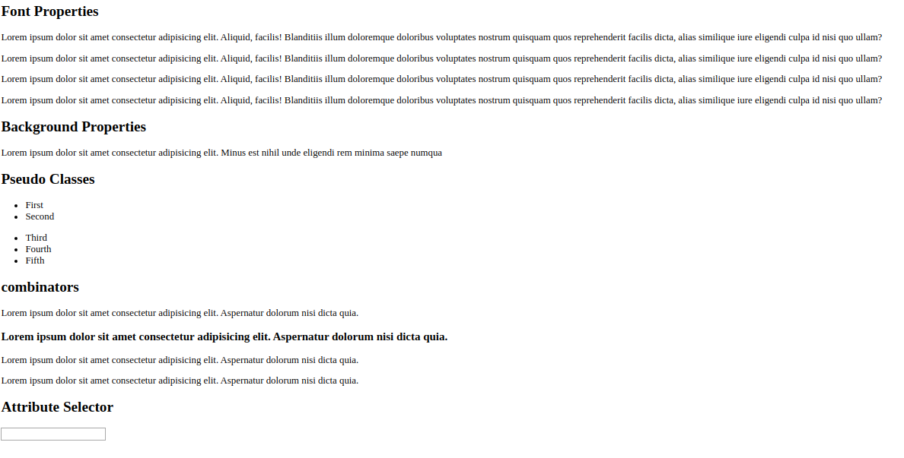

### Topics: CSS- Selectors, Fonts, Box Model  
#### Apply properties learnt into the layout  
Font Properties:  
Apply font properties (font-family, font-weight, font-size etc) on the given text.  
 
Background Properties:  
Apply background property (background-image, background-repeat etc)  

Pseudo selectors  
 Apply pseudo selectors (before,after, last-child etc)  

Combinators  
 Apply combinators (direct child >, adjacent +,  etc)  

Attributes
Use attributes selector (text, number etc)

### Screenshot  
  

### Replica
