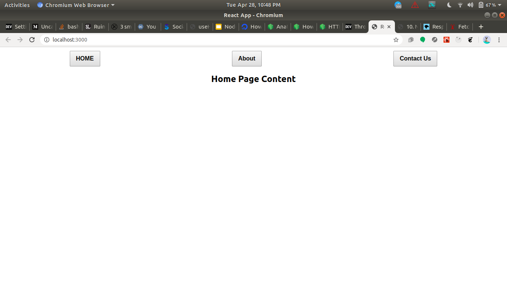

#### Exercises  

API made in 3rd are consumed in the React App  

1. Create a REST API for User entity with following fields:  
Username  
Password  
FirstName  
LastName  
Create search bar which will search by user name and will create an autocomplete list of user which fulfil the criteria.

2.  Create a student API which will return list of all students.  
Create a table which will show all users  
Create filter for student branch name and on clicking on filters it will show students accordingly.

3.  Create header which will show following items  
Home  
About  
Contact us  
On clicking on the items it will load the pages

server is in server.js (npm run server)  
frontend is in frontend (cd frontend && npm start)  
frontend is only made for 3rd question

