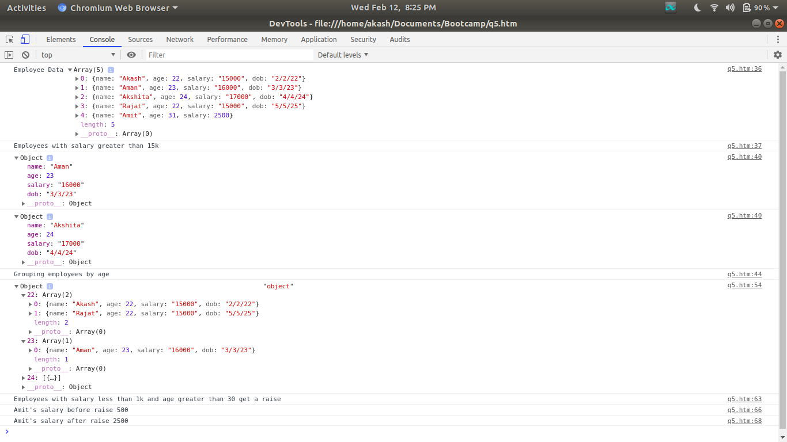

### Question  
create a list of objects of Employee with info as follow :
1. Name, age, salary ,DOB
2. filter all employees with salary greater than 5000
3. group employee on the basis of their age
4. fetch employees with salary less than 1000 and age greater than 20. Then give them an increment 5 times their salary.  

### Output
